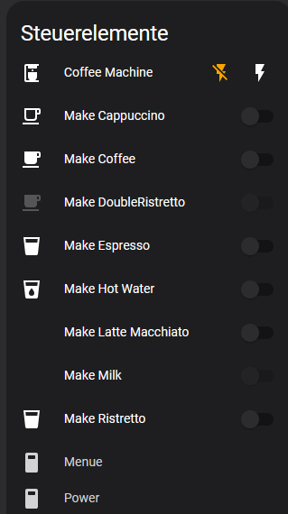

## ESPhome - Jura Impressa J9.3
This is an ESPhome custom component to communicate with a Jura Impressa J9.3 coffee machine.  It may also work with other serially-controlled Jura models with minimal adjustment.

It allows monitoring and control via HomeAssistant:



***

### ESP Interface
Hardware is a Wemos D1 Mini connected to the 7-pin Jura service port via a 3.3V<->5V logic level converter.\
The D1 mini is powered from the Jura.


Above image taken from [here](https://community.home-assistant.io/t/control-your-jura-coffee-machine/26604).


If you have diffuculty, try swapping the TX/RX pins.

***

### Create Commands
Commands for your machine can be generated using the provided script, `generate_esphome_jura_yaml.py`.  It requires the `bitarray` Python module to be installed.

      $ ./generate_esphome_jura_yaml.py AN:01

            - uart.write: [0xDF, 0xDB, 0xDB, 0xDF]  ## 'A'
            - delay: 8ms
            - uart.write: [0xFB, 0xFF, 0xDB, 0xDF]  ## 'N'
            - delay: 8ms
            - uart.write: [0xFB, 0xFB, 0xFF, 0xDB]  ## ':'
            - delay: 8ms
            - uart.write: [0xDB, 0xDB, 0xFF, 0xDB]  ## '0'
            - delay: 8ms
            - uart.write: [0xDF, 0xDB, 0xFF, 0xDB]  ## '1'
            - delay: 8ms
            - uart.write: [0xDF, 0xFF, 0xDB, 0xDB]  ## '\r'
            - delay: 8ms
            - uart.write: [0xFB, 0xFB, 0xDB, 0xDB]  ## '\n'

Particular commands seem to vary by model.\
These work on the Impressa J9.3.

|Command | Action|
| :---: | :---: |
|AN:01 | Switch On|   
|AN:02 | Switch Off|   
|||   
|FA:01 | Power button|    
|FA:02 | Menu button|    
|||
|FA:03 | Make 1 Espresso|    
|FA:04 | Make 1 Coffee|    
|FA:05 | Make 1 Ristretto|    
|FA:06 | Make 1 Cappuccino|    
|FA:07 | Make 1 Latte Macchiato|    
|FA:08 | Make Hot Water|     
|FA:09 | Make Hot Water|        
|FA:0A | Cup Lights on|    
|FA:0B | Menu|     
|FA:0C | Menu Back|       
|FA:0D | Menu Forward|    
     

***

### Response from RT Command:    
    
example Response:
```
rt:00800001448B00000046001400062CB4005600208C7E00020000001A0000007D
```

|Counter|Position| DEVICE |STRING |   
| :---: | :---:  | :---:  | :---: |
|1 Espresso|(3,7)|128|0080:128|  
|1 Ristretto|(7,11)|1|0001:1|   
|1 Coffee|(11,15)|17547|448B:17547|
||(15,19)|0|0000:0|   
|Cappuccino|(19,23)|70|0046:70|    
|Latte Macchiato|(23,27)|20|0014:20|    
|Powder Coffee|(27,31)|6|0006:6|  
||(31,35)||2CB4:11444|
|Clean|(35,39)|86|0056:86|    
|Decalcify|(39,43)|32|0020:32| 
||(43,47)||8C7E:35966|
||(47,51)||0002:2|
|2 Ristretti|(51,55)||0000:0|     
||(55,59)||001A:26|     
|2 Espressos|(59,63)|6|0006:6|    
||(63,67)||007D:125|
|||||    
|Hot Water|()|15||     
|Milk|()|3||     
|Filter|()|4||     
|Milksystem Clean|()|12||     
|2 Coffee|()|45||    
|Total|()|17823||    
     
***  
    
### To-Do:
- Determine how to initiate a Force Rinse action on this model
- Status of "Fill Beans", "Need Cleaning", and "Need Flushing"
- Actual machine power state (currently we use an 'Optimistic', 'Assumed State' Template switch in ESPhome)
